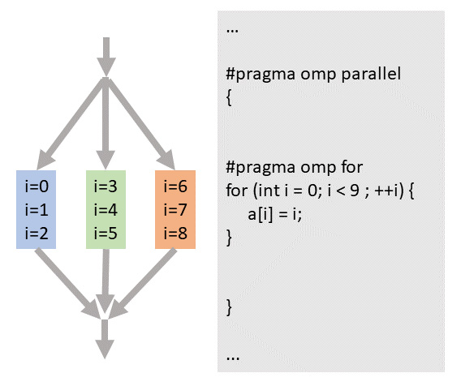

## Objectives

You will:

* learn how to spawn OpenMP threads in your C/C++ code
* how to compile C/C++ code with OpenMP enabled using `setuptools`

We'll use the code in directory `openmp`. Start by
```
cd openmp
```

## Why implement OpenMP parallelisation

On way to speed up your application is using the available resources more efficiently. This approach was used while porting our python code to C++ by removing the interpreter's overhead. Here we'll improve performance by using more resources. 

Most of modern computers have multi-core CPUs. Each of these cores can compute instructions in parallel if instructed to do so. All cores can access the same, shared memory so we will need to be careful about instructions stepping over each other - so called race conditions.

## What is OpenMP

OpenMP (Open Multi-Processing) is an application programming interface (API) for shared memory multiprocessing programming in C, C++ and Fortran.  An OpenMP parallelised application starts as a serial application (on a single compute core). When instructed by the programmer, the application spawns a number of threads (which run on multiple cores). Thus, work can be distributed to leverage more resources. Note: OpenMP can also be used to offload computations to GPUs.

### Pros

* suitable for shared memory architectures and accelerators, all modern CPUs have several cores
* uses pragmas, easier to implement than MPI
* can be used in combination with other parallelisation methods, e.g. MPI

### Cons

* limited to the resources of a single compute node

## How to use OpenMP

To use OpenMP we need to
* tell the compiler to apply OpenMP
* add instructions in the code, specifying where and what to parallelise
* set the number of threads to be used at run time

### Compiler switches

Use the following compiler switches:
* GNU: `-fopenmp`
* Intel: `-qopenmp`
* Cray: OpenMP is enabled by default, use `-noopenmp` to disable OpenMP

### Directives

OpenMP can be implemented using directives or/and the OpenMP Application Program Interface (API). The OpenMP API gives the programmer detailed control and provides extended functionality. For more information have a look at the latest [OpenMP standard](https://www.openmp.org/wp-content/uploads/openmp-4.5.pdf). 

Here we focus on OpenMP directives, which are comments (in Fortran) and pragmas (in C/C++) in the source code that are interpreted by the compiler. The same source code can be used to build a serial or threaded version of the application by turning off/on the OpenMP compiler switch.

OpenMP directives always start with:
* C/C++: `#pragma omp`
* Fortran (free form): `!$omp`

These are followed by the _directive names_ and _clauses_, controlling parallelisation and data handling. OpenMP directives can consist of multiple statements and can be extended to multiple lines using line continuation statements (C/C++ using `\` at the end of the line).

There are various ways to distribute the workloads, the most common being the parallel loop represented below:
[](images/example_omp_threads.png)

The application always starts in serial. When requested, multiple threads are created/spawned. In this particular case, the number of threads is 3 and each threads performs three iterations (9 iterations altogether).

### Data handling
Because OpenMP is based on the shared memory programming model, most variables are shared by default. Other variables like loop index are meant to be private. By private we mean that every thread gets its own copy of the variable - the variable can take a different value for each thread. The programer determines which variables are private and which are shared.

### Example
In the following, we parallelise a loop computing a sum.
```
#pragma omp parallel for private(arr) reduction(+:res)
for (int i = 0; i < nc - 1; ++i) {
   arr[0] = x[i]; arr[1] = y[i];
   res += computeProperty(arr);
}
```
With the `parallel` statement we spawn threads. The number of threads is set by the environment variable `OMP_NUM_THREADS`, which can be set to anything from 1 to the number of cores on a node, e.g. `export OMP_NUM_THREADS=36`. The `for` loop construct specifies what to parallelise. As a result the different iterations of the loop can be handled by multiple threads. Each thread gets its own copy of the loop index variable. Arrays `x` and `y` are shared - each thread has access to the same arrays `x` and `y`. Array `arr` is declared as `private` with each thread getting its own copy to prevent race conditions. The sum across iterations is stored in `res`, the value of which is collected from all thread. This is indicated by the `reduction(+:res)` directive.

## Exercises

 1. Add OpenMP pragma at line indicated by `// ADD OPENMP PRAGMA HERE` in `src/wave.cpp`

 2. Measure the speedup vs the number of threads (`OMP_NUM_THREADS` values) using problem size `-nx 256 -ny 256 -nc 1024`

