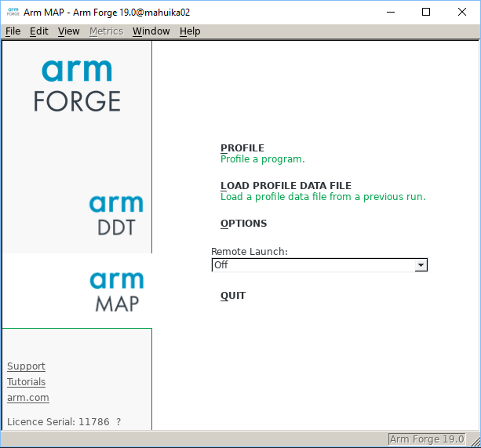
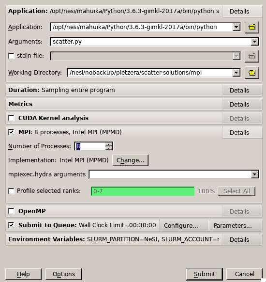
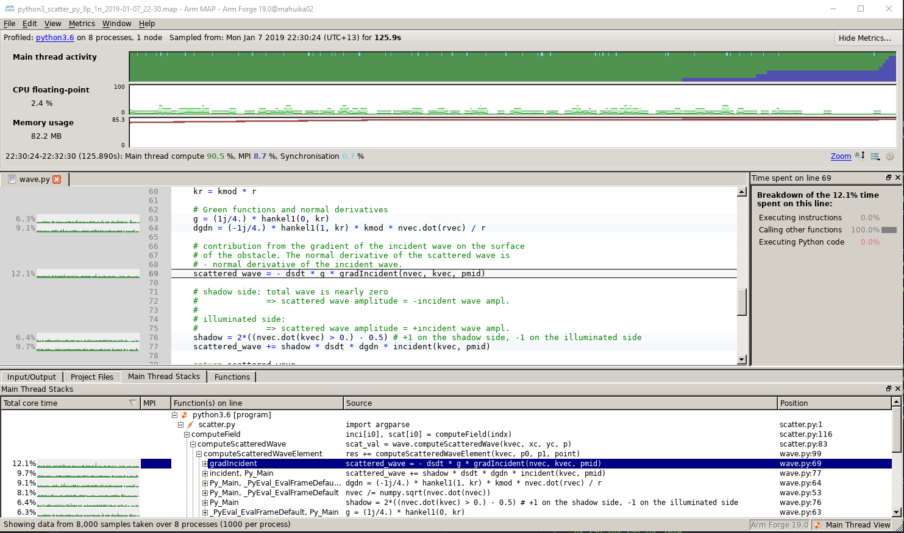

## Objectives

You will:

* learn how to use MAP to profile a code
* learn how interpret the MAP profiling data

## Introduction to profiling parallel codes

Parallel profiling tools provide information about how much time is spent in different parts of your code by different threads/processes.
There are two major ways to collect profiling data: 
 * *sampling*: during run time data are statistically gathered to determine which parts of the code are most time consuming. This is useful for identiying the hotspots in a code.
 * *tracing*: tracks the actual run time of instrumented parts of the code in time. This is useful to determine what each thread and process is doing at a particaular point in time. Tracing can reveal load balancing issues or the communication patterns of an MPI program. 

Due to a possible large overhead (especially for tracing experiments), the program could run significantly slower than normal. Therefore it is generally advisable to first run a sampling experiment and choose a small representative test case to profile.

## Profiling test case

The profiling case should be:
* representative by covering all features used during production
* short in run time for a fast turnaround

Scaling effects can be investigated by comparing profiles from small and big jobs

**Note:** keep in mind, that with shortened computation time, the initialisation and finalisation may become dominant.


## ARM MAP profiler

On NeSI systems the [ARM MAP](https://www.arm.com/products/development-tools/server-and-hpc/forge/map) profiler is provided as part of the *forge* module (along with the parallel debugger, DDT).

MAP is a commercial product, which can profile parallel, multi-threaded and single-threaded C/C++, Fortran, as well as Python codes. It can be used without code modification.
MAP can be launched with a graphical user interface and without. The graphical user interface allows the user to navigate through the code and focus on specific source lines. The "Express Launch", without graphical user interface, makes it ieasy to submit job scripts and workflows.

For more details see the [ARM MAP documentation](https://developer.arm.com/docs/101136/latest/map).

In the following, both the graphical user interface and express launch versions are used with the scatter example.

## Scatter MPI test case

We'll use the code in directory `mpi` of the *solutions* branch. Start by

```
git --fetch all
git checkout solutions
cd mpi
```

## Using the "Express Launch"

To use ARM MAP we need to load `module load forge` in our batch script and add `map --profile` in front of the parallel run statements. Thus, `srun` and its options, as well as our executable and its arguments are passed to MAP.
Thus in the script we will have something like:

```
module load forge
map --profile srun --tasks=8 python scatter.py
```

As a result some general information about the program run is printed to stdout from MAP as well as a file with the profiling information. This has the file ending `.map`. The results can be viewed by launching *map* with that file (see section [MAP Profile](#map-profile) ).

## Using the graphical Interface

The graphical user interface can be started after loading `module load forge` and launching
```
map
```

[](images/ARM_MAP_main.png)

Click on "PROFILE". In the profile menu we need to specify the executable (in this case `python`), the arguments (here `scatter.py` and any additional options if present) and a working directory. Additional to that, we need to define the parallelisation parameters, e.g. 8 MPI processes.

[](images/ARM_MAP_run.png)

Furthermore, the "submit to queue" parameter needs to be checked, for example the `--hint=nomultithread` can be specified there.

After submitting, MAP will wait until the job is allocated, connect to the processes, run the program and gather all the data. Then the profile information will be presented.

## MAP Profile

The profile window is divided into three main sections.

[](images/ARM_MAP_scatter_mpi.png)

On top, various metrics can be selected in the "Metrics" menu.
In the middle part, a source code navigator connects line by line with profiling data.
Most interesting for us here, is the profiling table on the bottom, which presents the most time consuming parts of the program with function names, the actual source code, and its location.
For more detail, the table can be extended with the most time consuming parts of the contained sub-function calls.

The Metrics part can be changed to:
* Activity timeline
* CPU instructions
* CPU Time
* IO
* Memory
* MPI

As an example, "CPU instructions" present the usage of different instruction sets during the program run time.

[](images/ARM_MAP_scatter_mpi_CPU.png)

## Exercises

 * 